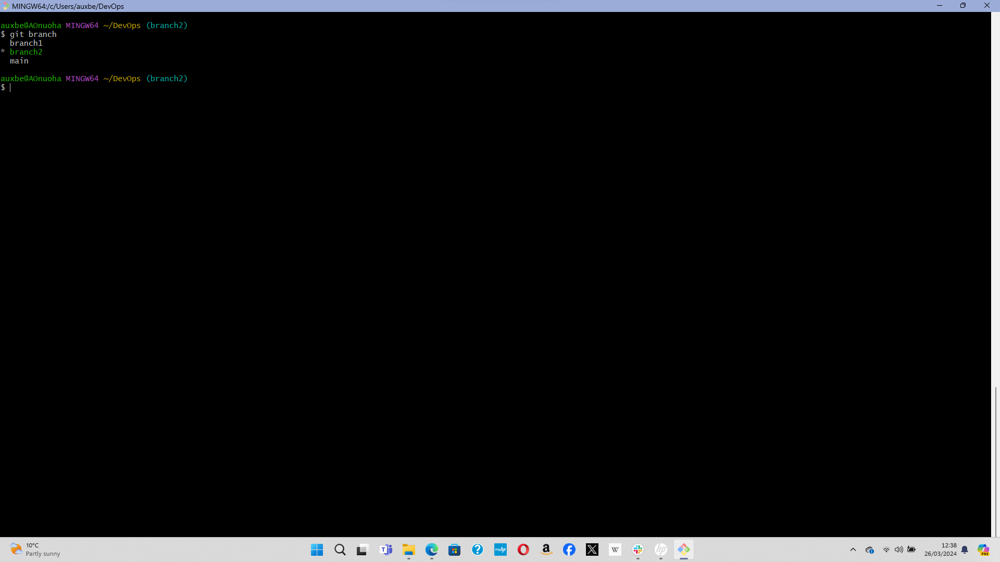
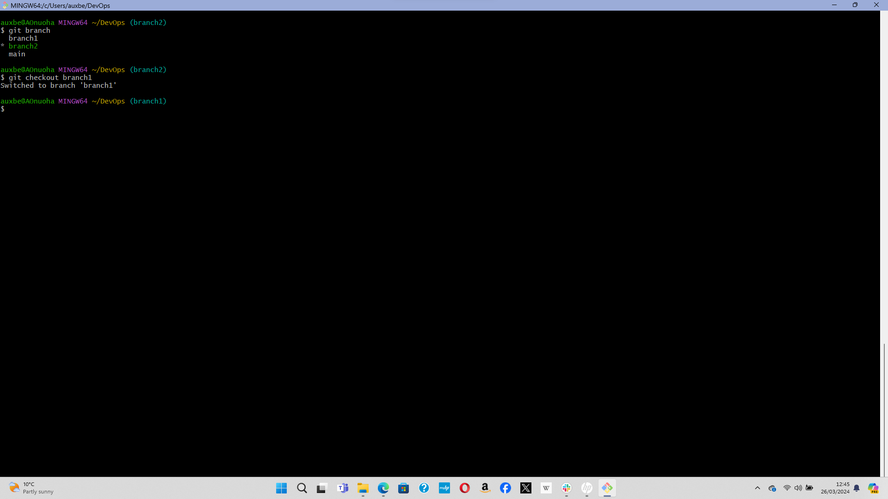
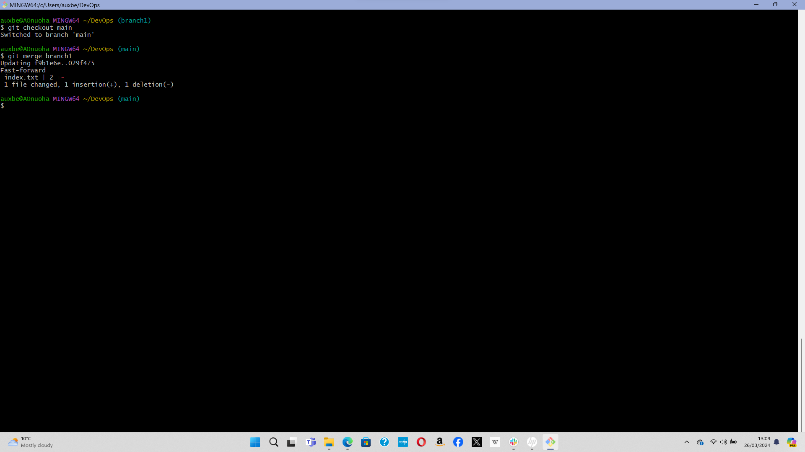

# Initializing a Git Repository

# Making first commit

* The -m flag is used to provide a commit message. The message concisely explains why the commit was made.

# Make your first git branch

* Execute the command 'git checkout -b [new branch name]'

*  This command creats the new branch and switches you from the extant branch to the new one.

# Listing your git branches

* Execute the command 'git branch' to list all the branches in your local git repository.

# Switching to an old branch

* Execute the command 'git checkout [branch name] to change into an old branch.

# Merging one branch into another

* To merge say 'branch1' into barch 'main', first swithch to branch 'main'.

*  Then execute the command'git merge [branch1]'

