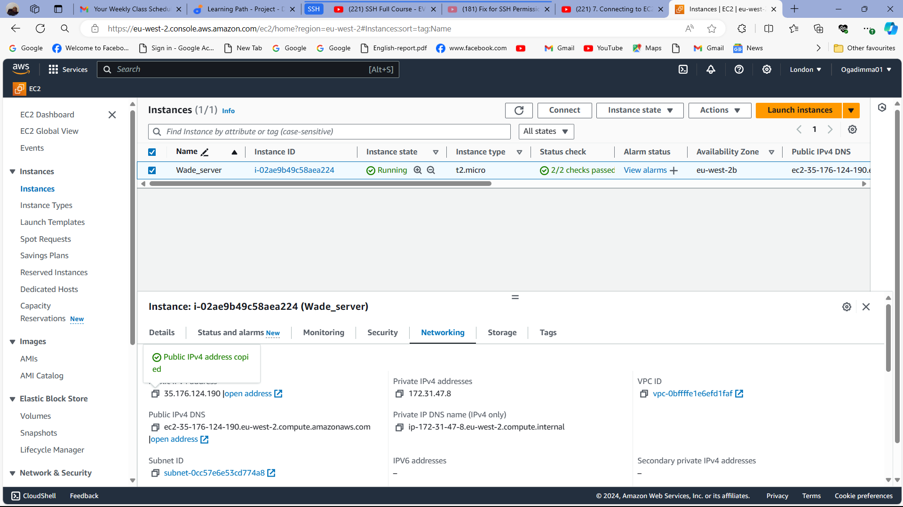
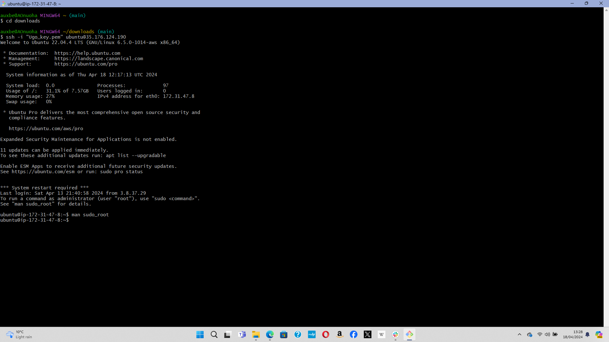
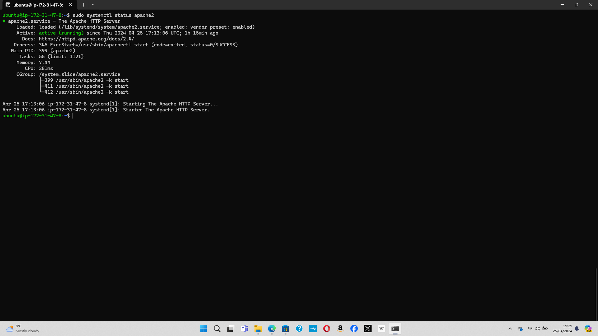

# Prerequisites

* Launching an EC2 instance

* Connectiong to EC2 instance from Git bash terminal

 

* Wnenever an EC2 instance is stopped and started again, a new IP address is generated so the ssh credentials must be updated in order to connect to the EC2 instance

# Installing Apache and Updating the Firewall

