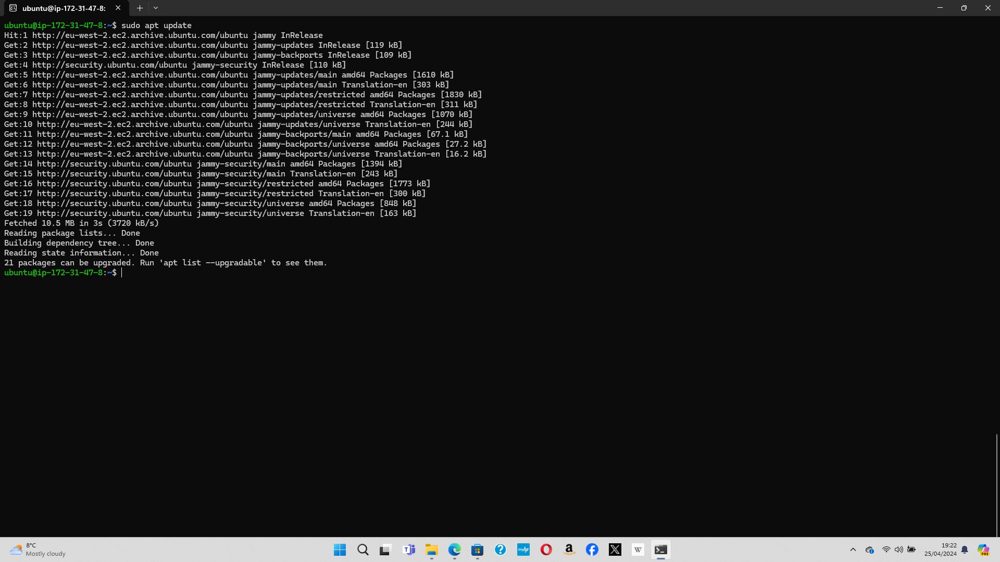
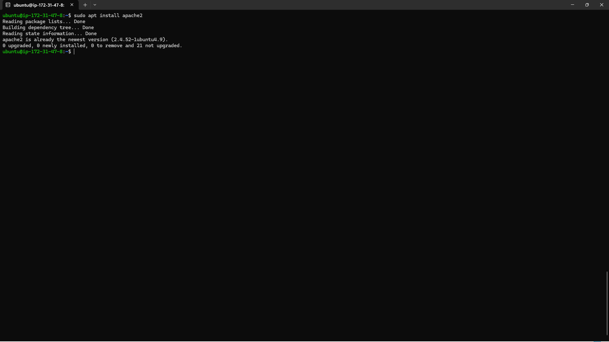
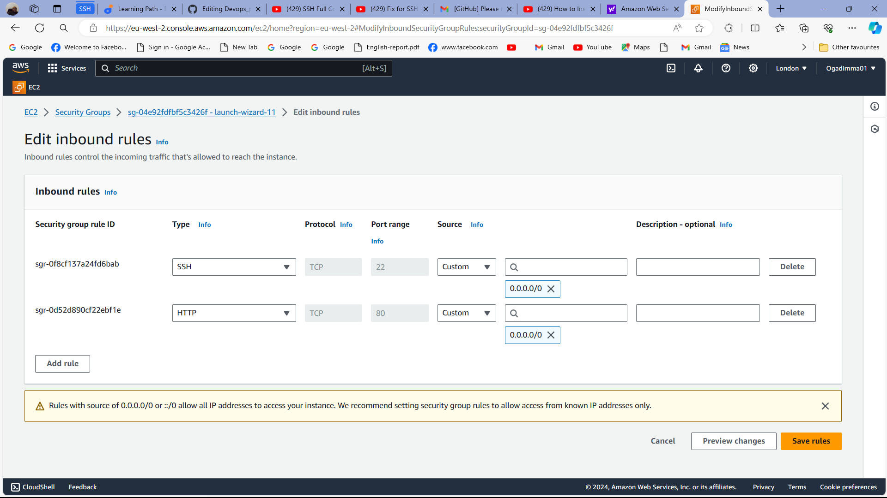
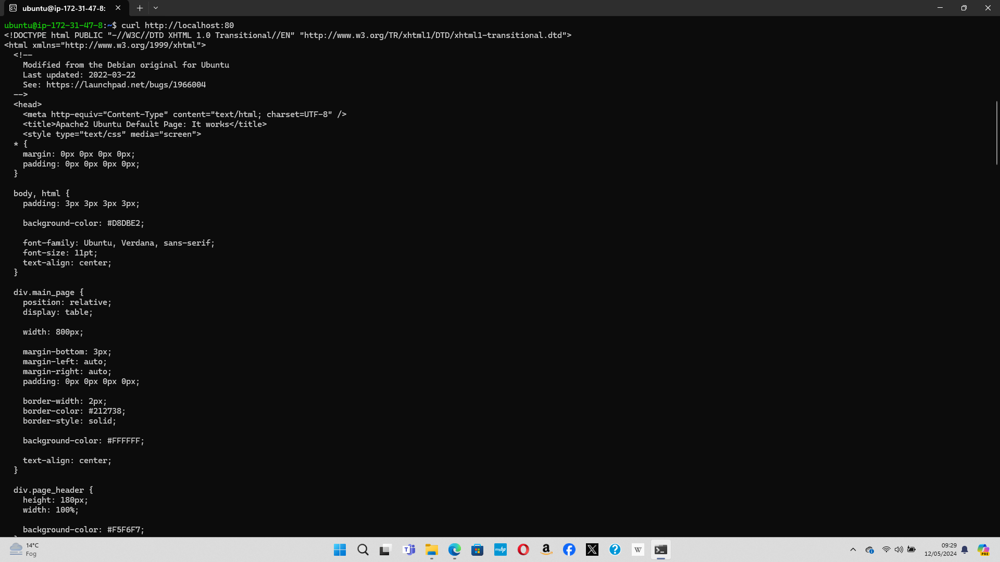
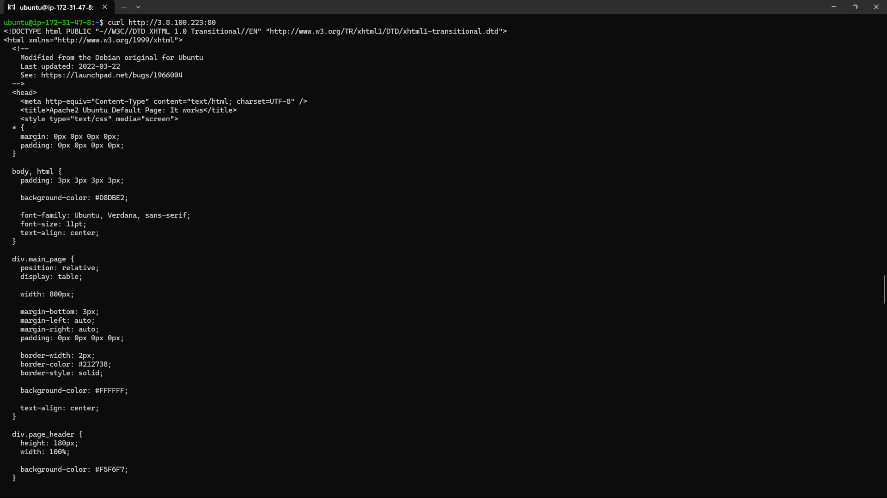

# Prerequisites

* Launching an EC2 instance

* Connectiong to EC2 instance from Git bash terminal

 

* Wnenever an EC2 instance is stopped and started again, a new IP address is generated so the ssh credentials must be updated in order to connect to the EC2 instance

# Installing Apache and Updating the Firewall

* Verify thhat Apache2 is running as a service on the OS

* To enable traffic to web server, add a rule to EC2 connection to open inbound connection through port 80

* To access server locally in the ubuntu shell run

1. using the DNS name

2. using the public IP address

