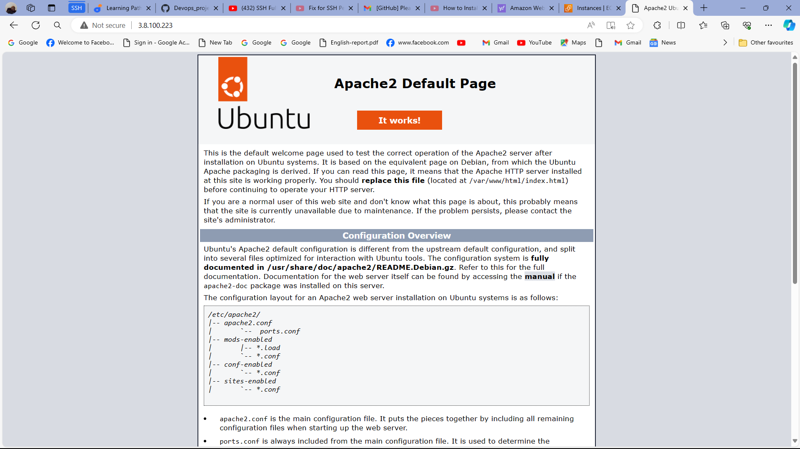
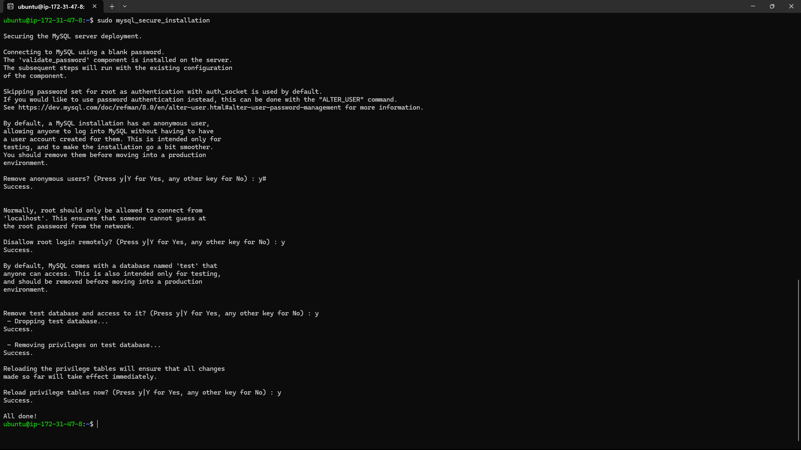

# Prerequisites

* Launching an EC2 instance

* Connectiong to EC2 instance from Git bash terminal

 

* Wnenever an EC2 instance is stopped and started again, a new IP address is generated so the ssh credentials must be updated in order to connect to the EC2 instance

# Installing Apache and Updating the Firewall

* Verify thhat Apache2 is running as a service on the OS

* To enable traffic to web server, add a rule to EC2 connection to open inbound connection through port 80

* Once installation is complete,confirm PHP version

* To access server locally in the ubuntu shell run

1. using the DNS name

2. using the public IP address

* To test response of Apache HTTP server to a internet request:

  Open a web browser and search for the following url: http://<public ip address>

If the above web page is returned, then the server has correctly installed and accessible through the firewall.

# Installing Mysql

* To log into mysql server  as administrative database root user.

* Running interactive script

* Logging into Mysql using changed root user password.

* Exiting mysql.

# Installing php

* php is available on Ubuntu Linux, but unlike Python (which comes pre-installed), must be manually installed.

* Before installing php you should install Apache (or a preferred web server) and a database service such as MySQL

* In addition to php, you'll need php-mysql, a php module that allows communication between php and mysql-based databases and libapache-mod-php
  to enable apache handle php files. Core PHP packages will automatically be installed as dependencies.

* Once installation is complete, confirm php version <php -v>

  

