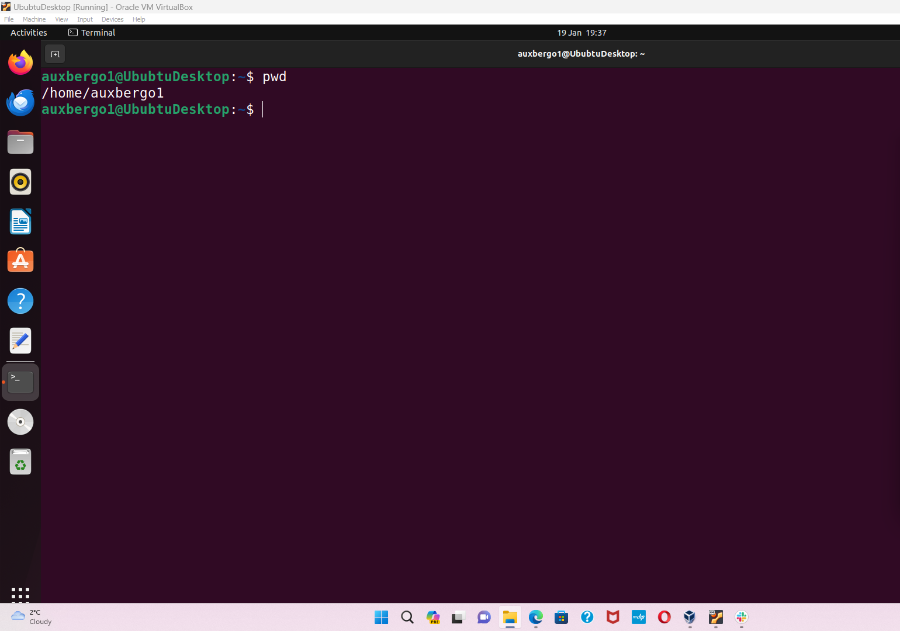

# File Manipulation
## Sudo command
* Short for superuser do.
* The sudo command enables the user to perform tasks which require administrative or root permissions.
* The user is promted for their account password following the command.
* Once access is granted, the user is allowed 15 minutes accesss after whcich they are again prompted for their password.
* Syntax: sudo (command) e.g sudo (apt update) i.e *sudo apt update*

  
  * Options can be used with sudo to do a variety of things.
    e.g *sudo -l* allows the user to know which permissions they are allowed access to
  * the image below shows that I can do everything as sudo.

*sudo -s* takes the user straight from the home directory into the root directory in which they can perform all tasks which require sudo privileges.

Sometimes we can forget to type in 'sudo' in a sudo command. Typing sudo followed by double exclamation marks executes the previous command using sudo privileges
Syntax: *sudo !!*

## pwd command
* pwd allows the user to print the name of the current directory which may also be refered to a the working directory.
* The pwd command tell the user where they currently are on the computer's directory structure.
* pwd is important because it is easy to get lost in the maze of the file structure so it helps the user find exactly where they are currently working.
the image below shows that I am currently in my home directory.

In the image below, I use the pwd command to locate my current working directory which is not my home directory.

* The -P flag and the -L flag can be used to show the physcal and the logical paths respectively.
* the two flags are usually of the same value but can be different if the path includes sim links.

# cd command
* The cd command allows the user tochange from one directory to another in order to navigate through the maze of files and directories in linux.
* the syntax may involve either the full path or the directory name depending on the current working directory.
  Syntax: $cd path
* in the image below, I have changed directory from my home directory to another directory in my home dirctory.

* Running the cd command alone takes the user back to their home folder.

Syntax: $cd

  
### Some Shortcuts

Syntax: $cd .. takes the user one directory up

Syntax: $cd / takes the user from their home direcrory straight into root.

Syntax: $cd - takes the user back to the previous directory. repeating the command immediately after restores the direcroy

# The ls command

* ls stands for "list storage". Running the ls command without a flag returns a list of all the files and directories in the user's current working directory.

Syntax: $ls

Syntax: $ls -l returns a long listing with a lot more information on the contents of the current working directory.

Syntax: $ls -ls (another directory) returns the list of files and directories in the specific dirctory.

  
  

  
