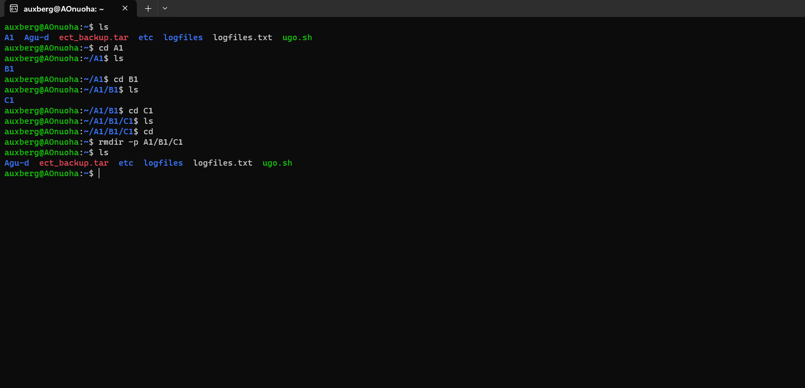
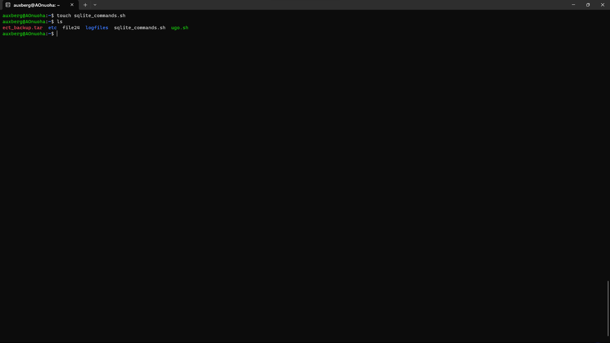
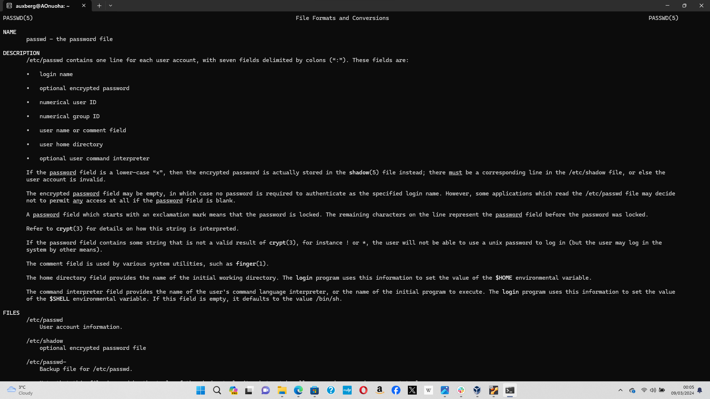
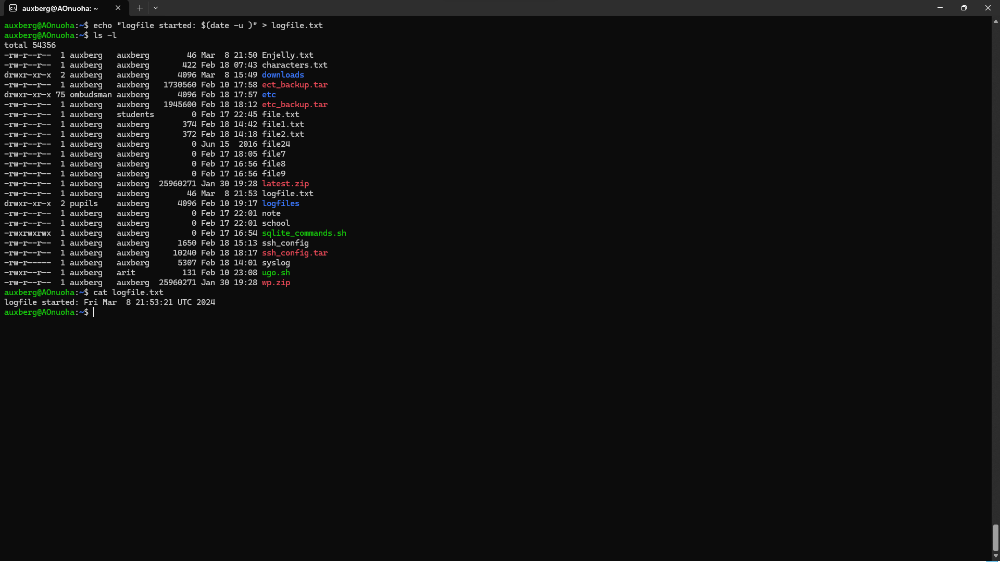

# File Manipulation
## Sudo command
* Short for superuser do.
* The sudo command enables the user to perform tasks which require administrative or root permissions.
* The user is promted for their account password following the command.
* Once access is granted, the user is allowed 15 minutes accesss after whcich they are again prompted for their password.
* Syntax: sudo (command) e.g sudo (apt update) i.e *sudo apt update*

  
  * Options can be used with sudo to do a variety of things.
    e.g *sudo -l* allows the user to know which permissions they are allowed access to
  * the image below shows that I can do everything as sudo.

*sudo -s* takes the user straight from the home directory into the root directory in which they can perform all tasks which require sudo privileges.

Sometimes we can forget to type in 'sudo' in a sudo command. Typing sudo followed by double exclamation marks executes the previous command using sudo privileges
Syntax: *sudo !!*

## pwd command
* pwd allows the user to print the name of the current directory which may also be refered to a the working directory.
* The pwd command tell the user where they currently are on the computer's directory structure.
* pwd is important because it is easy to get lost in the maze of the file structure so it helps the user find exactly where they are currently working.
the image below shows that I am currently in my home directory.

In the image below, I use the pwd command to locate my current working directory which is not my home directory.

* The -P flag and the -L flag can be used to show the physcal and the logical paths respectively.
* the two flags are usually of the same value but can be different if the path includes sim links.

# cd command
* The cd command allows the user tochange from one directory to another in order to navigate through the maze of files and directories in linux.
* the syntax may involve either the full path or the directory name depending on the current working directory.
  Syntax: $cd path
* in the image below, I have changed directory from my home directory to another directory in my home dirctory.

* Running the cd command alone takes the user back to their home folder.

Syntax: $cd

  
### Some Shortcuts

Syntax: $cd .. takes the user one directory up

Syntax: $cd / takes the user from their home direcrory straight into root.

Syntax: $cd - takes the user back to the previous directory. repeating the command immediately after restores the direcroy

# The ls command

* ls stands for "list storage". Running the ls command without a flag returns a list of all the files and directories in the user's current working directory.

Syntax: $ls

Syntax: $ls -l returns a long listing with a lot more information on the contents of the current working directory.

Syntax: $ls -ls (another directory) returns the list of files and directories in the specific dirctory.

* ls -h give the file sizes in human readable forms e.g Megabites, gigabites, kilobites etc.
* The ls -l and ls -h commands can be combined

Synyax: $ls -lh

Syntax:l $ls -a returns hidden files alongside visible ones. Files with period at the beginning of the file name are considered hidden.

* Hidden files will not be shown by difault on the file manager as well as on the terminal when one runs the ls command.

* CTRL+H is the equivalent of ls -a command on the file manager.

* ls -l, ls-a and ls -h can be combined in a single command, syntax: $ls-lah

* Syntax: $ls -R lists all files in the subdirecrories

)

* Syntax$ls -F diffrentiates between files and directories by putting /at the end of every directory

* Syntax: $ls-lhtr sorts the files according to dates and time of modification instead of alphanumeric order

# cat command

* the cat command rimaririly enables the user to concatenate files. in practice however, it is often used to show the contents of files and the concatenate or combine them.
Syntax: $cat (file name) opens the file
Syntax: $cat (file name) (file name) concatenates to files that have been previously opened using the cat command.

* $cat panama.txt escravos.txt > kingston.txt combines the first two files and stores the output in the third file

* cat -n (combined file) assigns line numbers to the contents in the combined file.

* the cat command can be used as part of a command chain when chaning different commands together. One can use cat against kinggston.txt and chains it into the grep command and have the grep command search for a particular word in the content of kingston.txt e.g dogs. the command returns the content of the file highlighting the word 'dog' everywhere it appears in the file content.
Syntax: $cat kingston.txt | grep dog

# cp command

* The cp command enables the user to copy a file or group of files
* The syntax requires two file names to be specified in the command line
* The first file is copied into the second.
Syntax: $cp file1 file2
* If the destinatin file does not exist (file2), it will be created bfore before copying is effected. but if file2 exists it will be overwritten without any warning from the system.

  

  * To copy new files into a directory, the syntax is $cp <file1> <file2> <direcrory name>

  

 
  * the cp command can copy more than file at a time. in this case, the destination must ne a directory which alredy exists.
    Syntax: $cp <file1> <file2> <file3> <diir1>

  
  
  ## cp options

  *  $cp -i warns the user before **overwriting** the destination file
 
  

 * To copy an entire directory, first pass the -R flag before typing the **source directory** followed by the **destination directory**
 
  

# mv command
* The command has two functions
  1. it renames a file or directory. Syntax: $mv <file1> <file2). File1 will be renamed file2 and the contents of file1 moved to file2. This command does not create a copy of the file. it simply renames it.

 2. It moves a agroup of files to a different directory. Syntax: $mv <file name> <dir name>

* The mv command does not prompt the user for confirmation.

## mv options

* $mv -i prompts the user for confirmation before moving a file that would **overwrite** an existing file. the user must then enter 'y' to confirm.

* $mv -f prompts for confirmation before overwritng a file that is **write protected**. this option **forcefully** overwrites a write protected file and **deletes** the source file.

* $mv -b creates a backup of an existing file that would be overwritten following the mv command.

# mkdir command

* the mkdir command is used to create one or multiple irectories at once and give permissions to each of them
* Use syntax: $mkdir (new directory) to create a new dirctory in the home directory

* To create a new dirrectory in an existing dirctory in the home directory, use syntax: $mkdir (home directory) (new directory)

* to crreate a sudirectory

* To dreate a subdirecrory in a directory that does not exist. Using the -p flag enables the user to create a directory structure whcich the facilitakes the crearion of a new directory that previously did not ecist.
* -p can be replaced with the full version --parents.

* Note that the directory'names did not previously exist in the directory called Desktop.

* The -p flag can also be used to create a chain of subdirctories from one parent direcrory. Syntax: $mkdir -p D1/D2/D3/D4/D5

* To create several directories inside a parent directory. Syntax: $PD mkdir -p PD/{N1,N2,N3,N4,N5}
* Note that there are no spaces after the comas in the curly brackets.

* $mkdir -v informs the user that a directory has been created after execution of command.

* The -m flag sets file permissions. By default the permission for read is 4, write is 2 and execute is 1.
* Permission for read, write and execute is 7
* Persission for read and write and not execute is 6
* Permisssion for write and execute without read is 5

* Note that user, group and othesr havs read, write and execute permissions on the dirctory 'Ingrid folder in the image above.

* Note in the image above that user and group permissions are for read and write but no execute whereas others have no permissions for the direcrory named General.

* the user can also assign permissions using numbers for read=4, write=2 and execute=1

* In the image above, user had read and write permissions, group has read onlu permission whereas others have no permissions.

# rmdir command

* This is used to remove an permanently remove or delete an empty directory. This requires the user to have sudo privileges in the parent directory. This command will fail to remove any directory that is not empty

* To delete a hierachy of directories in which one empty directory is located inside another, the rmdir command can be used in combination with the -p flag. The -p flag only works if all directories in the hierachy are empty.

* If a directory is not empty, then the rm command in combination with the -r flag must be used to permanently delete it.

# rm command
* This removes or deletes a file without prompting for confirmation. A file once deleted cannot be recovered.

* To delete more than one file with one rm command, seperate the files with spaces:

* The rm command in combination with the -i flag prompts the user for confirmation. Selecting the 'y' key permanently deletes file.

1{photo](Images/rm-i.png)

* Whem used with the -r flag, the rm command recursively deletes all subdirectories and files within the subdirectories and the parent directory. Normally, the rm command would not delete a directory but with the -f flag, it will delete directories as well.

* The -f flag whem used with the rm command forcefully removes a file without prompt for confirmation even if the file is write protected.

# touch command

* This is used to easily crreate new empty files. One can create any number of files simultaneously.

* It is also be used to change timestamps on existing files and directories. A timestamp is information associated with a file which identifies an important time in the file's history.
* Types of time stamps include: ### Access time:
                                                Thisis the last time the file was read.
                                ## Modification time:
                                                This is the last time the contents of the file were modified.
                                ## Change time  This is the last time the file's metadata was changed.
* These time stamps can be viewed by using the stat command e.g stat file7

* touch command can be used to chnge access and modification time individually
* -a flag is used to change access time

* -m flag is used to change modification time

* the timestamp can be modified to an arbitray time by using the touch command with the -d flag followed by the required timestamp in string e.g touch -d "2016-06-15 21:45:22" file24.
  This will modify yhe timestamp to June 15 2016.

# locate command
* The locate command can find a file in the database system.
* Adding the -i flag turns of case sensitivity.

# find command
* This command is used to search for files within a spacific directory.

# grep command
* grep stands for global regular expression print.
* The whole purpose of grep is to search for texts within files.
* The ssh_config file has 53 lines of text.
* grep can be used to search for a particular word within the file.

*The -v flag can be used alongside grep to exclude a particular word from the search.

* the -n flag alongside the grep command assigns numbers to fetched items according to their numerical positions in the file.

*The -c flag returns the count or number of times the searched item apears in the file without showing the lines.

* The grep command is case sensitive by default. applying the -i command overrides the case sensitivity.

* The -r command is used to recursively search for an item in every file in the system.

![photo](Images/grepr.png

# The df and du command.
* The df and du commands deal with disc usage.
* df stands for 'disk free'.
* The -h option returns the human readable output for the df command.

* The -T option adds anothe column of information containing the file system type of the mount.

*The -x option can be used to exclude idems we are not interested in e.g tmpfs.

* The du command is used to find out how much space is used on the folder or directory level.
* The way the du command works is that if you give it a pathway to a directory, it will show you how much space is used up inside thatt directory.
* The pathway to the directory of interest must be specified when using the du command

* The problem with the du commnand is that it floods the screen with a lot of information.
* We can clean up this information by limiting how far within the directory tree the du command is allowed to go.

* The -s option is used to print a summary of disk usagewithin a directory or multiple directories. Be sure to use root when trying to access directories that require sudo privilages.

* The -c option prints the total dusc usage within more than one directory

# The head command

* The head command prints the first ten lines of a file.

* The -n option is used to specify the number of lines to be printed.

# The tali command

* The tail command prints the last ten lines of a file

* The -n option is used to specify the number of lines to be printed.

 

# The diff command

* the diff command is used show any differences between files. If there is no difference between two files, the command will not return an output. Use the -s option to confirm similarity.

* When they exist, differnces between files are printed with the diff command.

# The tar command

* This command allows us to archive multiple files into one archive file much like a zip file.
  
* Unlike files in a zip file however, files in a tar file are not compressed.
  
* Files in a tar file can be compressed by choice.

* The -t option lists contents of the tar file without extracting them.

* The -v option adds multiple columns to the output.

* The -x option is used toextract files from a tar file. This comes in handy when a deleted file is to be restored from a backup.

# The chmod command

* This command is used to modify  a file or directory's read, write, and execute permissions for owner, group and other.

* r = 4, w = 2, x = 1
  

# The chown command

* This comand is used to change ownership of directories, files or symbolic link to a specified user name.

* Change of group ownership of a file can also be effected using the chown command.

# The jobs command

* The jobs command in Linux allows the user to directly interact with processes in the current shell.

* Jobs have three possible states in Linux: foreground, background, and stopped.

* Job Control has several different functions. Each can be run independently. Here is a table of the commands related to Job Control.

* Command	Description
   jobs	Lists jobs in current shell
   bg %n	Send process to background
   fg %n	Bring process to foreground
         n represents the number of the corresponding job ID.

* To Sending a job to work in the background, you just need to append your command with an & (ampersand) symbol.

* You can see this command returns the job number in the brackets. The following number is the process ID used by the kernel.

* View jobs using the jobs command

* The PID number isn’t listed here, but you don’t need it. You control jobs using the user/shell-specific job ID.

* You can use that Job ID to bring your instance of nano to the foreground.

* You can stop open jobs by using Ctrl+z. Here’s a screenshot that shows how to use this with top.

* In the images below, I use Ctrl+z to suspend it, view it in my jobs list, and then bring it back to the foreground before closing it.

# The kill command

* Once in a while, some applications may start behaving erratically and become unresponsive or start consuming a lot of system resources.
  
* Unresponsive applications cannot be restarted because the original application process never shuts down completely.

* The only solution is to either restart the system or kill the application process.

* The kill command is used to terminate an unresposive program mannually.

* In order to use the kill command, the PID of the program must be known.

* To get the PID of a running program, use 'pidof [name of the process].

* We can also use 'ps -ux' or 'ps aux' to print a list of all running processes on our system

* The syntax for the kill command is 'kill -flag PID'

* Of 64 flags that can be used with the lill command 'SIGKILL' and 'SIGTERM' are most commonly used. The SIGTERM flag requests a program to stop running and gives it time to save all of its processes whereas the SIGKILL flag forces a program to stop without saving it's processes.

# The ping command

* This command is used to confirm that a target server is online.

* The command can also be used for trouble shooting all forms of connectivity problems

* The ping command also be used to find out when an instance comes back online after some period of being offline.

* syntax: ping [option] [host name or ip address]

* In linux, the ping command will ping forever until we use 'CTRL + C' to come out of it and reyurn to the command line.

* We can actually use the -c option to preset the nunmber of pings we get from a ping command

# The wget command

* This command allows us to download files from the internet using the HTTP, HTTPS and FTP protocols

* Syntax: wget [option] [url

* We can use the -O option to set a custom name for the file

* We ca use the -P option to set a custom path for the downloaded file.

# The uname command

* This command is used to print detailed information about the Linux system and hardare

# the top command

* This command will display all running processes in real time.

* It catalogues resource utilization from CPU usage to memory usage.

* the top command can also be used identify to kill any processes that may be using too many system resources.

# THe history command

* This command gets the system to list up to 500 previously executed commands.

* Any command in the list can be re-executed using the number on the left of the command without re-entering the entire command. This requires sudo priviledges

* sudo !! re-executes the most recent command in the history

# The man command

* This command allows you to view the manual pages for many of the commands that are available on Linux terminal.

* These manual pages contain information like commandline arguments, usage examples and so on.

* Different sections of the man pages can be viewed by appending the session number to the man command.

# The echo command

* The basic use of the echo command is to reuturn a line of text or string using the standard output.

* Another very popular use of the echo command is to print the content of a variable. aAn example is the variable msg containing the content "Hello World"

* Because the echo command is a built-in utility, there are many variables intercessions are created for us in Linux

* As examples, you can just echo the SHELL variable and the HOME variable.

* The -e option enables the interpretation of many backlash escapes.

* Using the -e option you can sound an audible alert when you run an echo command. The -e option allows you to change the format of the text that appears when you run the echo command

* You can also use the backspace character in echo using the -e option

* Notice that letter 'a' was deleted in the output.

* You ca use the -e option to print a shorter output by removing part of the sring.

* The -e option can also be used to introduce a new line in the output.

* The echo comand can be used to redirect output to a textfile.

 

* You can also add a tab character to the output

You can use the echo command to redirect output to a textfile.

# The zip, unzip command

* The zip command is used to compress files to reduce file size and is also used as a file package utility in Linux.

* If you have limited bandwidth between two servers and want to transfer the files faster, then zip the files and transfer them.

* The zip command puts one or more compressed files into a single zip archive, along with information about the files (name, path, date, time of last modification, protection, and check information to verify file 
  integrity). An entire directory structure can be packed into a zip archive with a single command.

* To view the content of a zip file, use the syntax: zipinfo [filename]

* The unzip command is used to unzip a zipped file; syntax: unzip [filename]

# The hostname command

* Use this to print the hostname of your system.

* When run with the -i otion, it prints the ip address of the system.

  
