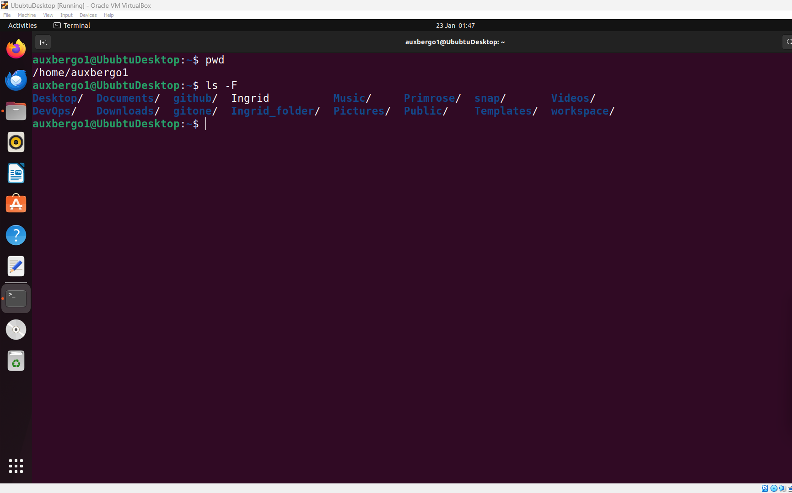
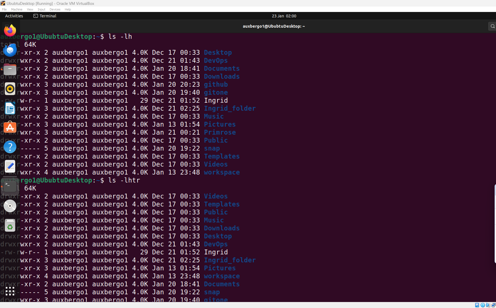

# File Manipulation
## Sudo command
* Short for superuser do.
* The sudo command enables the user to perform tasks which require administrative or root permissions.
* The user is promted for their account password following the command.
* Once access is granted, the user is allowed 15 minutes accesss after whcich they are again prompted for their password.
* Syntax: sudo (command) e.g sudo (apt update) i.e *sudo apt update*

  
  * Options can be used with sudo to do a variety of things.
    e.g *sudo -l* allows the user to know which permissions they are allowed access to
  * the image below shows that I can do everything as sudo.

*sudo -s* takes the user straight from the home directory into the root directory in which they can perform all tasks which require sudo privileges.

Sometimes we can forget to type in 'sudo' in a sudo command. Typing sudo followed by double exclamation marks executes the previous command using sudo privileges
Syntax: *sudo !!*

## pwd command
* pwd allows the user to print the name of the current directory which may also be refered to a the working directory.
* The pwd command tell the user where they currently are on the computer's directory structure.
* pwd is important because it is easy to get lost in the maze of the file structure so it helps the user find exactly where they are currently working.
the image below shows that I am currently in my home directory.

In the image below, I use the pwd command to locate my current working directory which is not my home directory.

* The -P flag and the -L flag can be used to show the physcal and the logical paths respectively.
* the two flags are usually of the same value but can be different if the path includes sim links.

# cd command
* The cd command allows the user tochange from one directory to another in order to navigate through the maze of files and directories in linux.
* the syntax may involve either the full path or the directory name depending on the current working directory.
  Syntax: $cd path
* in the image below, I have changed directory from my home directory to another directory in my home dirctory.

* Running the cd command alone takes the user back to their home folder.

Syntax: $cd

  
### Some Shortcuts

Syntax: $cd .. takes the user one directory up

Syntax: $cd / takes the user from their home direcrory straight into root.

Syntax: $cd - takes the user back to the previous directory. repeating the command immediately after restores the direcroy

# The ls command

* ls stands for "list storage". Running the ls command without a flag returns a list of all the files and directories in the user's current working directory.

Syntax: $ls

Syntax: $ls -l returns a long listing with a lot more information on the contents of the current working directory.

Syntax: $ls -ls (another directory) returns the list of files and directories in the specific dirctory.

* ls -h give the file sizes in human readable forms e.g Megabites, gigabites, kilobites etc.
* The ls -l and ls -h commands can be combined

Synyax: $ls -lh

Syntax:l $ls -a returns hidden files alongside visible ones. Files with period at the beginning of the file name are considered hidden.

* Hidden files will not be shown by difault on the file manager as well as on the terminal when one runs the ls command.

* CTRL+H is the equivalent of ls -a command on the file manager.

* ls -l, ls-a and ls -h can be combined in a single command, syntax: $ls-lah

* Syntax: $ls -R lists all files in the subdirecrories

)

* Syntax$ls -F diffrentiates between files and directories by putting /at the end of every directory

* Syntax: $ls-lhtr sorts the files according to dates and time of modification instead of alphanumeric order

# cat command

* the cat command rimaririly enables the user to concatenate files. in practice however, it is often used to show the contents of files and the concatenate or combine them.
Syntax: $cat (file name) opens the file
Syntax: $cat (file name) (file name) concatenates to files that have been previously opened using the cat command.

* $cat panama.txt escravos.txt > kingston.txt combines the first two files and stores the output in the third file

* cat -n (combined file) assigns line numbers to the contents in the combined file.

* the cat command can be used as part of a command chain when chaning different commands together. One can use cat against kinggston.txt and chains it into the grep command and have the grep command search for a particular word in the content of kingston.txt e.g dogs. the command returns the content of the file highlighting the word 'dog' everywhere it appears in the file content.
Syntax: $cat kingston.txt | grep dog

# cp command

* The cp command enables the user to copy a file or group of files
* The syntax requires two file names to be specified in the command line
* The first file is copied into the second.
Syntax: $cp file1 file2
* If the destinatin file does not exist (file2), it will be created bfore before copying is effected. but if file2 exists it will be overwritten without any warning from the system.

  

  * To copy new files into a directory, the syntax is $cp <file1> <file2> <direcrory name>

  

  * To copy an entire directory, first pass the -R flag before typing the **source directory** followed by the **destination directory**
 
  
  

  
